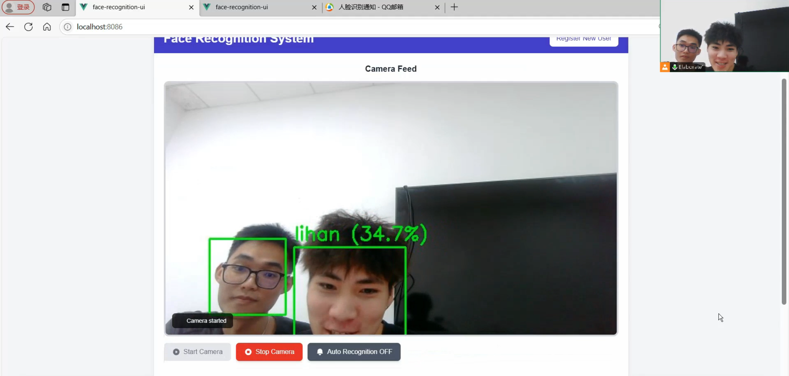
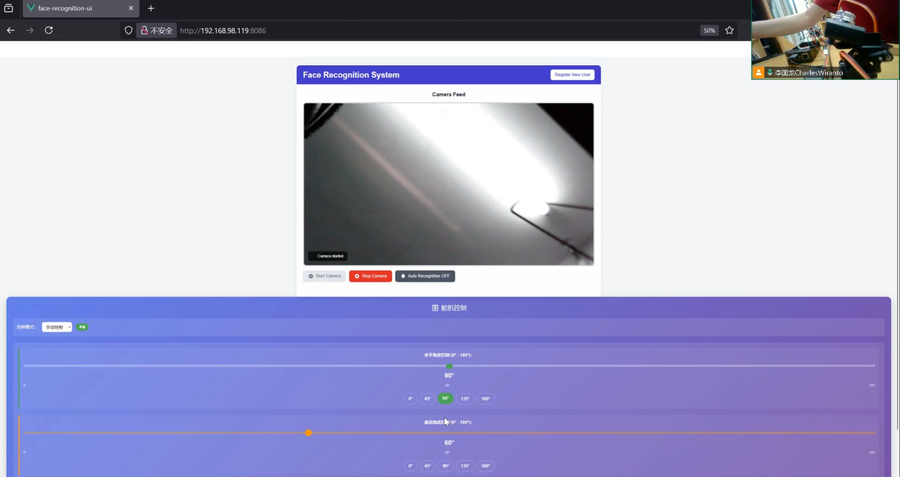
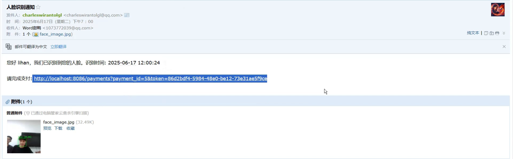
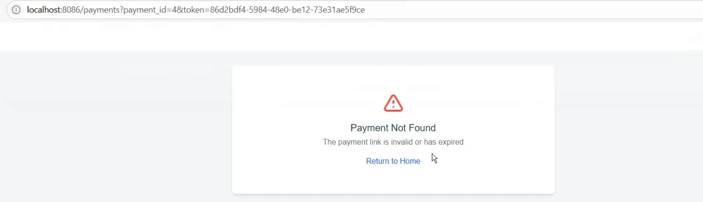
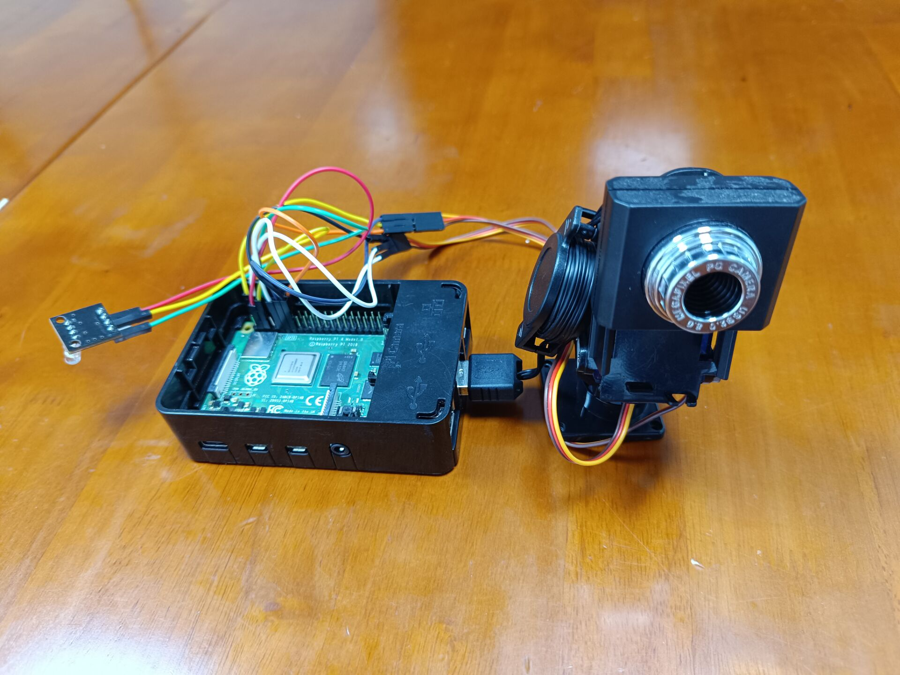

# 基于树莓派的人脸触发支付提醒系统

作者：李涵 & CHARLES WIRANTO 李国龙　　

## 简介

> 本作品基于树莓派边缘计算平台，融合计算机视觉技术与物联网应用，构建 “人脸检测 - 支付提醒 - 邮件通知” 全自动化流程。硬件层面采用树莓派搭配摄像头、舵机及 LED 灯，软件层面通过 Python 结合 Flask 框架实现后端逻辑，前端采用 Vue.js 开发交互界面，借助 OpenCV 完成人脸检测与识别，集成支付宝 SDK 实现支付功能，并通过 Sunny-Ngrok 实现内网穿透。

## 树莓派接口：

- GPIO 2 - **红色LED**
- GPIO 3 - **绿色LED**
- GPIO 17 - **横着舵机**
- GPIO 27 - **竖着舵机**
- USB - **摄像头**（1. **GEMBIRD** Generic UVC 1.00 camera [AppoTech AX2311] & 2. YWS-241011-X H **Deli**-2K-Camera-Audio）

## 运行方式：

### 1. 前端

> **npm install**
>
> **npm run serve**

### 2. 后端

> **pip install -r requirements.txt**
>
> **python app.py**

## 运行结果

### 1. 前端

#### 人脸识别页面



#### 注册页面


#### 舵机控制页面




### 2. 后端

#### 邮件收到



#### Token来保证安全性



## 附加：

### 硬件连接



### 目录

```
final
├── Back-End/
│   ├── Services/
│   │   ├── models/
│   │   │   ├── deploy.prototxt
│   │   │   └── res10_300x300_ssd_iter_140000.caffemodel
│   │   ├── __pycache__
│   │   ├── app.py
│   │   ├── camFace.py
│   │   ├── config.py
│   │   ├── database.py
│   │   ├── face_payment.db
│   │   ├── face_service.py
│   │   ├── face_trainer.py
│   │   ├── haarcascade_frontalface_default.xml
│   │   ├── init_db.py
│   │   ├── models.py
│   │   ├── requirements.txt
│   │   └── static/
│   └── face_payment.db
├── Front-End/
│   └── face-recognition-ui
│       ├── babel.config.js
│       ├── jsconfig.json
│       ├── node_modules
│       ├── package.json
│       ├── public/
│       ├── src/
│       │   ├── App.vue
│       │   ├── assets
│       │   ├── config.js
│       │   ├── main.js
│       │   ├── router/
│       │   └── views/
│       │   │   └── FaceRecognition.vue
│       │   │   └── PaymentsManagements.vue
│       │   │   └── UserRegistration.vue
│       ├── tailwind.config.js
│       └── vue.config.js
└── sunny

```

**根目录**

- **Back-End/**
       后端服务目录，包含所有与人脸识别、支付、数据库等相关的后端代码和资源。
- **Front-End/**
       前端服务目录，包含基于     Vue.js 的前端界面代码。

 

**Back-End/Services** **目录**

**1.** **主要代码文件**

- **app.py**
       Flask 主应用入口，负责路由注册、服务启动、API 逻辑等。通常包含服务初始化、API 路由、摄像头管理、支付接口等。
- **camFace.py**
       摄像头操作相关代码，通常用于捕获视频流、拍照、与 OpenCV 交互。
- **config.py**
       配置文件，存放全局配置参数，如数据库路径、密钥、第三方服务配置等。
- **database.py**
       数据库操作相关代码，包含数据库连接、初始化、CRUD 操作等。
- **face_service.py**
       人脸识别相关服务逻辑，可能包含人脸检测、特征提取、比对等功能。
- **face_trainer.py**
       人脸识别模型训练脚本，通常用于收集人脸数据、训练模型、保存特征等。
- **init_db.py**
       数据库初始化脚本，用于创建数据库表结构、插入初始数据等。
- **models.py**
       数据模型定义，可能包含     ORM 类、数据结构定义等。
- **payment_service.py**
       支付服务相关逻辑，如支付宝接口封装、支付通知处理等。
- **email_service.py**
       邮件发送服务，负责发送通知邮件（如识别成功、支付提醒等）。

**2.** **资源与依赖**

- **haarcascade_frontalface_default.xml**
       OpenCV 的 Haar 特征人脸检测模型文件。
- **face_payment.db**
       SQLite 数据库文件，存储用户、人脸特征、支付记录等。
- **requirements.txt / requirement4.txt**
       Python 依赖包列表，便于环境部署。
- **deploy.prototxt**
       Caffe DNN 模型的结构定义文件。
- **res10_300x300_ssd_iter_140000.caffemodel**
       Caffe DNN 人脸检测模型权重文件。
- **.env**
       环境变量配置文件，存储敏感信息如密钥、数据库连接等。

**3.** **其他目录**

- **models/**
       存放深度学习模型相关文件（如 deploy.prototxt、caffemodel）。
- **static/**
       静态文件目录，存放前端可访问的图片、捕获的人脸照片等。
- **pycache/**
       Python 编译生成的缓存文件夹。

 

**Front-End/face-recognition-ui** **目录**

**1.** **配置文件**

- **babel.config.js**
       Babel 配置文件，用于     JavaScript 语法转换。
- **jsconfig.json**
       JavaScript 项目配置文件，便于编辑器智能提示。
- **package.json**
       Node.js 项目依赖和脚本配置文件。
- **tailwind.config.js**
       Tailwind CSS 框架的配置文件。
- **vue.config.js**
       Vue CLI 项目的配置文件。

**2.** **目录结构**

- **node_modules/**
       Node.js 依赖包目录。

- **public/**
       公共静态资源目录（如     index.html、favicon 等）。

- **src/**
       源代码目录，包含前端主要逻辑。

- - **App.vue**
          Vue 应用主组件。

  - **main.js**
          应用入口 JS 文件。

  - **config.js**
          前端配置文件，可能包含      API 地址等。

  - **assets/**
          静态资源（图片、样式等）。

  - **router/**
          路由配置目录。

  - **views/**
          页面组件目录：

  - - **FaceRecognition.vue**
             人脸识别页面组件。
    - **PaymentsManagements.vue**
             支付管理页面组件。
    - **UserRegistration.vue**
             用户注册页面组件。

**其他**

- **sunny**
       这个是外网部署的命令资源，运行如下的命令：

  sunny --server=free.idcfengye.com:4443 --key=180753448317  sunny --server=free.idcfengye.com:4443 --key=171035448313  

 

## BiliBili连接：

> https://www.bilibili.com/video/BV15gKWzxECc/?vd_source=db7703aea92034f99901f90585cab408

## GitHub连接：

> https://github.com/CharlesWiranto/RasPi_face_payment_reminder
